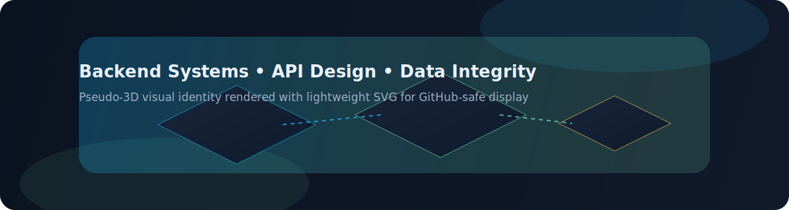

  

<h1 align="center">✦ Sarthak Srivastava ✦</h1>
<h3 align="center">Full-Stack Engineer focused on building reliable backend systems and clean product experiences</h3>

I build full-stack products with strong backend foundations, clear APIs, and structured data flows.

Designing systems where correctness, clarity, and reliability come first.

  <a href="https://sarthaksrivastava.netlify.app/">Portfolio</a> •
  <a href="https://linkedin.com/in/sarthak300">LinkedIn</a> •
  <a href="mailto:sarthaksrivastava189@gmail.com">Email</a> •
  <a href="https://leetcode.com/u/sarthaksrivastava189/">LeetCode</a>

Live portfolio showcasing full-stack projects and system-focused implementations

  

  

---

## 🧠 System Thinking

Visual architecture snapshot

  

---

## 🚀 Highlighted Work

### Digital Farmers Market (MERN)
Direct farmer-to-consumer marketplace with role-aware product and order workflows.

**Problem**
- Farmers and consumers needed a single platform with separate capabilities and secure access.
- The system needed clear ownership boundaries for listings, orders, and user actions.

**Approach**
- Designed REST APIs in Express with role-aware middleware.
- Built authentication using JWT and protected route checks.
- Structured MongoDB around users, listings, and order lifecycle.
- Implemented focused React flows for listing, browsing, and ordering.

**Key Decisions**
- Chose role-based authorization at API layer to keep permission logic centralized.
- Kept endpoint contracts explicit to reduce frontend-backend ambiguity.
- Organized schema for predictable listing and order operations.

**Engineering Insight**
- Access control is easiest to maintain when enforced in middleware instead of scattered handlers.
- Designing data ownership early reduces downstream coupling between features.

This project strengthened my understanding of backend correctness and system design trade-offs.

**Stack**
Node.js, Express, MongoDB, React, JWT

### MedQueue - DSA-Integrated Queue System
Queue and appointment management system using circular-queue-style token flow for clinical operations.

**Problem**
- Clinics need a predictable queue process for both scheduled and walk-in patients.
- Token transitions must stay consistent across booking, serving, and completion states.

**Approach**
- Applied circular queue logic to model token progression and avoid ad-hoc sequencing.
- Structured booking and queue operations with explicit status transitions.
- Modeled MySQL data for appointments, queue records, and doctor slots.
- Validated state before transitions to protect queue correctness.

**Key Decisions**
- Treated queue status as a state machine to avoid invalid transitions.
- Kept booking and queue concerns separate to simplify debugging and maintenance.
- Used deterministic token progression to keep behavior predictable.

**Engineering Insight**
- Real system correctness depends more on state transition discipline than UI flow.
- DSA concepts become most valuable when mapped to domain constraints, not isolated problems.

This project strengthened my understanding of backend correctness and system design trade-offs.

**Stack**
PHP, MySQL, JavaScript, DSA (Circular Queue)

### Interactive Quiz Management System
Secure quiz platform with modular backend structure and admin-driven content operations.

**Problem**
- Quiz systems need controlled authoring, secure sessions, and clean result persistence.
- Admin operations should remain clear without tightly coupling routes and business logic.

**Approach**
- Built Flask backend with SQLAlchemy models for quizzes, questions, attempts, and users.
- Used session-based authentication for controlled user/admin workflows.
- Organized modular CRUD flows to separate route handlers from data logic.
- Applied normalized schema to keep updates and queries consistent.

**Key Decisions**
- Chose normalized relational design for data consistency across quiz entities.
- Separated auth checks from core quiz handlers for cleaner logic.
- Kept admin CRUD paths explicit to reduce side effects.

**Engineering Insight**
- Clear data boundaries reduce complexity when adding new quiz features.
- Modularity in backend code directly improves testability and iteration speed.

This project strengthened my understanding of backend correctness and system design trade-offs.

**Stack**
Flask, SQLAlchemy, SQLite/MySQL, HTML, CSS, JavaScript

---

## ⚙️ Backend Engineering Playbook

### API Design
- Define endpoint purpose and request/response shape before implementation.
- Keep authorization checks near entry points using middleware or decorators.
- Validate inputs at boundaries to prevent invalid state from entering core logic.

### Data Modeling
- Start with entity ownership and lifecycle before writing tables/collections.
- Model relationships for query clarity, not just initial development speed.
- Keep schema naming and status enums consistent to reduce accidental misuse.

### Reliability
- Treat status transitions as controlled state changes, not loose flag updates.
- Handle edge cases first: duplicate actions, invalid transitions, stale data.
- Keep failure responses explicit so clients can recover predictably.

### Performance
- Use complexity awareness from DSA while designing backend logic paths.
- Prefer simple, index-friendly access patterns over complex nested operations.
- Measure likely hotspots early: list filtering, repeated lookups, and state scans.

---

## 🧩 Engineering Mindset

- Design full-stack systems with backend correctness as the foundation
- Keep interfaces explicit so teams can move faster with fewer regressions.
- Treat edge cases as core requirements, not late-stage fixes.
- Prefer maintainable architecture over clever short-term implementation.

---

## Competitive Programming

  

- **Sliding Window** -> efficient stream/range computations and moving aggregates.
- **Two Pointers** -> clean dual-index traversal for merge-like API data workflows.
- **Prefix Sum** -> fast repeated range insight for reporting-style features.
- **Binary Search** -> quick boundary decisions in sorted scheduling or lookup data.
- **Hashing** -> deduplication, frequency maps, and O(1)-style validation checks.
- **Queue/Stack patterns** -> predictable process ordering and controlled state flow.

Competitive programming helps me reason under constraints, detect edge cases early, and choose time/space-efficient backend paths.

---

## 🛠 Technical Stack (Full-Stack Focus)

I focus on backend-heavy full-stack development where system design and product experience work together.

**Backend:** Node.js, Express, Flask, PHP  
**Data and Persistence:** MySQL, MongoDB, SQLAlchemy  
**Frontend and Product Layer:** React, JavaScript, HTML, CSS  
**Tools:** Git, GitHub, Postman, VS Code, C++, Python

  

---

## 🎯 Current Focus

**Building now**
- Backend-heavy product features with cleaner API contracts and state handling.
- Better project documentation to show decision rationale and trade-offs.

**Improving next**
- Query optimization and indexing fundamentals.
- Caching basics and reliability-first backend patterns.
- Stronger hard-level DSA pattern application to production-style scenarios.

---

## 📊 Engineering Activity

  
  

---

## 🤝 Contact

Open to full-stack engineering roles where backend systems, data design, and reliability are core to the product.

- Reach me on LinkedIn: <a href="https://linkedin.com/in/sarthak300">linkedin.com/in/sarthak300</a>
- Email me directly: <a href="mailto:sarthaksrivastava189@gmail.com">sarthaksrivastava189@gmail.com</a>
- Coding profile: <a href="https://leetcode.com/u/sarthaksrivastava189/">leetcode.com/u/sarthaksrivastava189</a>

  

