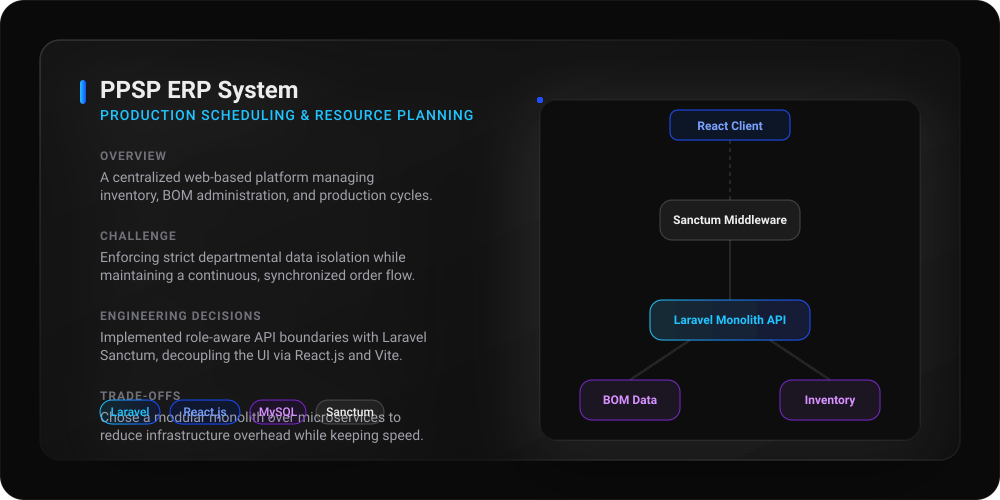
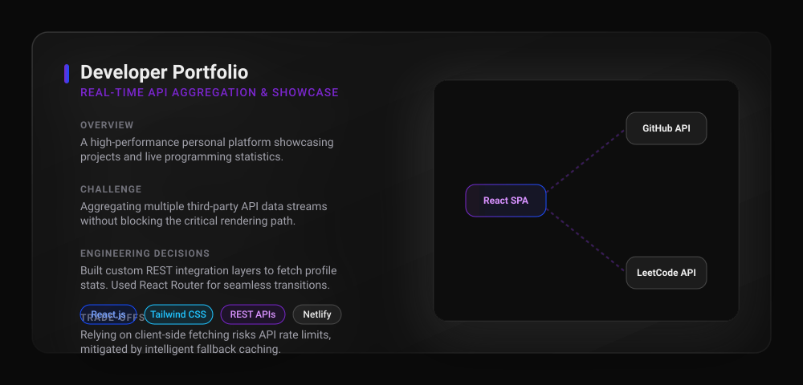
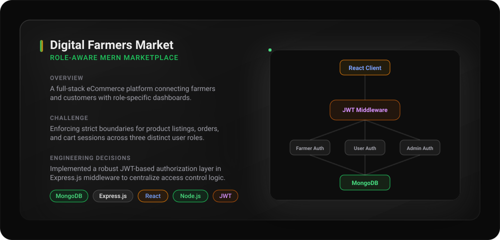

<!-- Hero Section (Custom Premium SVG) -->

 

<!-- Dynamic Typing Effect -->

 

<!-- Glassy Gold Social Badges -->

  
  
  
  

 

<!-- Engineering Philosophy (Custom Premium SVG) -->

---

## 🧑‍💻 About Me

I am a highly motivated **Software Engineer** specializing in building reliable, scalable backend infrastructure and clean, user-focused web applications. 

- 💼 **Focus:** Full Stack Development (MERN, System Architecture)
- 🎓 **Education:** B.Tech Computer Science & Engineering @ Lovely Professional University
- 🚀 **Philosophy:** Designing for reliability and scale.

 

---

## 🛠️ Tech Stack

  

---

## 📊 GitHub Stats

  

    
    &nbsp;&nbsp;
    
  

  

    
  

  

    
  

---

## 🧠 LeetCode Stats

  

    
  

---

## 🚀 Featured Engineering Case Studies

  

  

---

<!-- Timeline (Custom Premium SVG) -->

